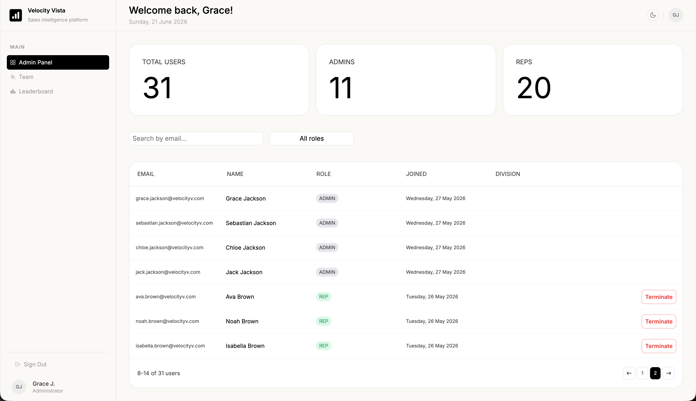
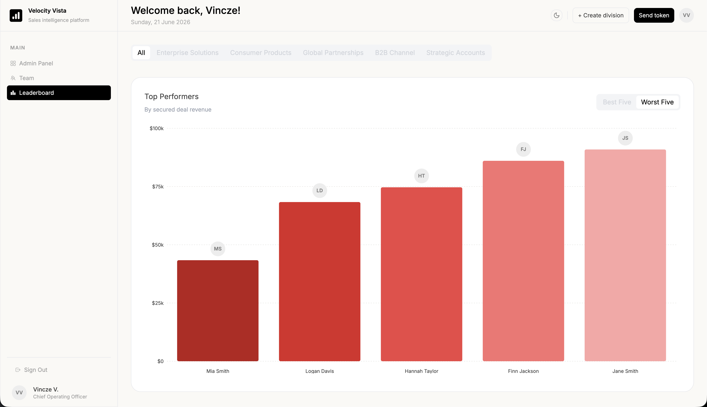

# Velocity Vista

A role-based sales intelligence dashboard built with Next.js 16 App Router and Supabase.

---

## Demo

Live at [velocityvista.vercel.app](https://velocityvista.vercel.app)

Test account (rep view):

- **Email:** jane@velocityv.com
- **Password:** Demouser850!

The demo is scoped to a rep account. The admin and COO layers — division
management, role-scoped user termination, token-gated invites — are shown
below and available to walk through in an interview.

**Admin panel — admin view**


**Leaderboard — COO view**


---

## Stack

Next.js 16 · React 19 · TypeScript · Supabase (Auth, PostgreSQL, Storage) · Tailwind v4

---

## Architecture decisions

**Server components by default.** All data fetching happens at the page level in server components and is passed down as props. There is no client-side data fetching — no `useEffect`, no loading states for initial data. Client components own UI state only.

**Server actions for mutations.** Form submissions go through typed server actions — `react-hook-form` handles client-side validation and `useActionState` handles the server response, connected via `startTransition`. Zod validates the payload before the database call in the log sale action, where user input warrants it. The settings modal is the exception: it passes `FormData` directly rather than a typed object, because File objects don't survive typed object serialization in Next.js server actions.

**Middleware-level route protection.** Route guards live in `src/proxy.ts` — the Next.js 16 middleware convention, replacing `middleware.ts` — not in page components. The middleware checks the session and role on every request and redirects before the page ever renders. Role is always read from `user.app_metadata` on the already-fetched session, never via a separate query to `profiles` — avoiding an extra round trip on every navigation. It's `app_metadata` specifically, not `user_metadata`: only the service role can write to it, so a signed-in user can never escalate their own role from the client. A database trigger stamps it atomically with the profile row at signup.

**Separate Supabase clients.** The regular client uses the anon key and respects RLS. A separate admin client in `src/lib/supabase/admin.ts` uses the service role key, scoped only to operations that require it — creating accounts on signup, verifying a target user's real role and division before a termination, then deleting the auth user. The two are never mixed.

**RLS as the enforcement layer.** Row-level security policies on the database handle data scoping — the application layer reflects that scoping, it doesn't duplicate it.

**Dark mode.** Implemented via Tailwind v4's `@variant dark` and `next-themes`. Color tokens are CSS variables with light and dark overrides — components don't reference Tailwind color utilities directly, so the theme switches without any class juggling at the component level.

---

## Role system

Three roles: `coo`, `admin`, `rep`. The role drives routing, data scoping, and UI visibility.

| Role    | Routing            | Data scope        |
| ------- | ------------------ | ----------------- |
| `coo`   | `/dashboard/admin` | All divisions     |
| `admin` | `/dashboard/admin` | Own division only |
| `rep`   | `/dashboard`       | Own division only |

COOs can create divisions, send signup tokens, and terminate any non-COO user. Admins can terminate reps within their division. Reps have no admin access.

---

## Pages

Every page and feature in VelocityVista is role-aware — what you see, what data is scoped to you, and what actions are available all depend on your role.

**Dashboard** — the rep's primary view. Displays a performance ring tracking secured rate against total deals, weekly and monthly stat cards (secured, lost, total with period-over-period deltas), a glance bar showing the current week's secured/lost split, a recent activity list sorted by closing date, and a dual-line chart toggling between weekly and monthly deal volume.

**Admin panel** — the elevated view for admins and COOs. Stat cards at the top show user and division counts, scoped to the admin's own division or globally for a COO. Below is a filterable user table with email search, role filter, and division filter (COO only). COOs can terminate any non-COO user; admins can terminate reps within their own division. COOs additionally get controls to create divisions and send signup tokens directly from the panel header.

**Leaderboard** — role-scoped charts showing rep performance by secured revenue for the current month. Reps see a best-five bar chart within their own division. Admins see both best and worst charts, division-scoped. COOs see both charts across all reps with a division pill filter to drill into a specific division.

**Team** — rep cards sorted by revenue, with gold, silver, and bronze treatment for top performers and a collapsible Needs Attention panel for the bottom performers — both available to admins (division-scoped) and COOs (all divisions, with a division pill filter). Reps see their own division unsorted with their own card pinned first in a distinct style, and no revenue figures or ranking treatment.

**Settings** — a modal accessible from the navbar and page header for uploading or removing a profile picture, with live preview before confirming.

---

## Token-gated signup

Sign up is not publicly accessible. A COO sends a signup token via email (Resend). The middleware validates the token against the `invites` table — checking existence and expiry — before the signup page loads. Invalid or expired tokens redirect to sign in. Tokens expire after 24 hours.

Account creation goes through the admin API (`supabaseAdmin.auth.admin.createUser()`) rather than the public sign-up call, so submitting the form doesn't log the browser into the new account — the same operator can create several accounts in one sitting without a session getting in the way.

---

## Data aggregation

Two aggregation strategies run in parallel. The leaderboard and team pages use PostgREST's aggregation support (`pgrst.db_aggregates_enabled`) to receive pre-summed revenue figures directly from the database. The dashboard — performance card, stat cards, glance bar — aggregates in JavaScript from raw sales rows via a shared `weeklyCalc` utility. That utility uses calendar Monday–Sunday boundaries, not rolling 7-day windows, and is consumed by every component on the main dashboard page.

---

## Running locally

```bash
npm install
npm run dev
```

`.env.local` requires:

```
NEXT_PUBLIC_SUPABASE_URL=
NEXT_PUBLIC_SUPABASE_ANON_KEY=
SUPABASE_SERVICE_ROLE_KEY=
RESEND_API_KEY=
NEXT_PUBLIC_APP_URL=http://localhost:3000
```

**Seeding** (requires grants below):

```bash
# Creates users across all divisions via the Supabase Admin API (handles auth correctly)
npm run seed:users

# Generates sales records per rep — current week, last week, and last month
npm run seed:sales
```

```sql
GRANT SELECT ON public.profiles TO service_role;
GRANT INSERT ON public.sales TO service_role;
```
